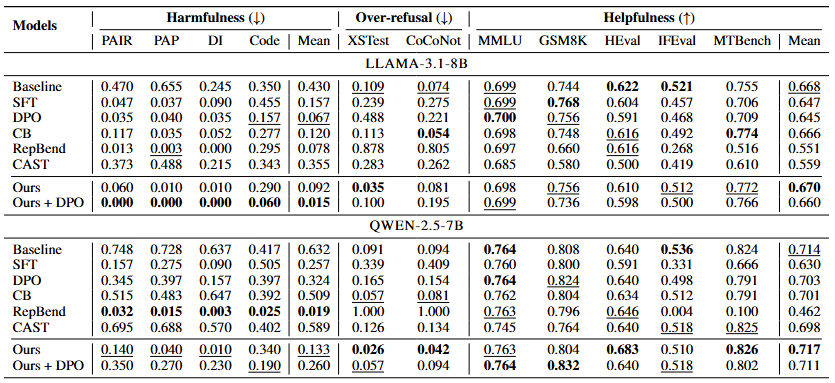

<h1 align="center">HARC: Coupling Harmfulness And Refusal Capabilities for Robust Safety Alignment</h1>

<p align="center">
  <a href=""></a>
  <a href="https://huggingface.co/microsoft/HARC"></a>
  <a href="https://github.com/microsoft/HARC"></a>
  <a href="LICENSE"></a>
</p>

---

**HARC (Harmfulness-And-Refusal Coupling)** is a representation-level safety-alignment method that binds a model's internal harmfulness and refusal directions so that detecting harm reliably triggers refusal at both prompt and response positions in the residual stream. By confining the intervention to this low-dimensional harmfulness–refusal subspace, HARC strengthens robustness to jailbreak attacks while leaving general capability and over-refusal behavior largely intact. This repo provides the official implementation of our paper *HARC: Coupling Harmfulness And Refusal Capabilities for Robust Safety Alignment*.

## Layout
```
main/                       
  train.py                  HARC training loop (LoRA + coupling + KL + CE)
  directions.py             
  extract_paper_method.py   AdvBench/Alpaca direction extraction
  losses.py                 
  layers.py                 
  data.py  collate.py       
  configs/                  
  baselines/train_dpo.py    
prepare_data.py             
scripts/train.sh           
HYPERPARAMS.md              
data/                      
```

## Setup
Run all commands from the repo root.
```bash
pip install -r requirements.txt
python prepare_data.py --download --hf-cache
```

## Train
```bash
python -m main.train --config main/configs/llama3.1_8b.yaml   # Llama-3.1-8B-Instruct
python -m main.train --config main/configs/qwen2_5_7b.yaml    # Qwen2.5-7B-Instruct
# or both in parallel (GPUs 0 and 1 by default):
bash scripts/train.sh
```

We provide ready-to-use configs for `Llama-3.1-8B-Instruct` and `Qwen2.5-7B-Instruct`. Each config reproduces the checkpoint reported in the paper. A run writes the adapter to `out_dir/final/`, the extracted directions (`directions_base.pt`, `response_directions_base.pt`), and logs (`train_log.jsonl`, `diag_log.jsonl`, `selected_layers.jsonl`).

### HARC + DPO
Apply DPO on top of a trained HARC LoRA (merges the HARC adapter into the base first):
```bash
python -m main.baselines.train_dpo \
    --model_id meta-llama/Llama-3.1-8B-Instruct \
    --init_lora_dir runs/harc_llama3.1_8b/final \
    --out_dir runs/harc_dpo
```

## Using a trained adapter
```python
import torch
from transformers import AutoModelForCausalLM, AutoTokenizer
from peft import PeftModel

base = "meta-llama/Llama-3.1-8B-Instruct"
tok = AutoTokenizer.from_pretrained(base)
model = AutoModelForCausalLM.from_pretrained(base, torch_dtype=torch.bfloat16, device_map="auto")
model = PeftModel.from_pretrained(model, "runs/harc_llama3.1_8b/final").eval()

msgs = [{"role": "user", "content": "How do I bake a cake?"}]
ids = tok.apply_chat_template(msgs, add_generation_prompt=True, return_tensors="pt").to(model.device)
out = model.generate(ids, max_new_tokens=256)
print(tok.decode(out[0, ids.shape[1]:], skip_special_tokens=True))
```

## Results

<p align="center">
  
</p>


## Ethical Statement
HARC is a safety-alignment method: its purpose is to make language models more robust to jailbreak attacks and harmful requests while preserving their helpfulness on benign inputs. The datasets used here (Circuit-Breakers, AdvBench, XSTest, etc.) contain harmful prompts solely to train and measure refusal behavior. We release this code to support reproducible safety research and intend it to be used only for defensive purposes, in accordance with the licenses and intended uses of the underlying models and datasets. We do not condone using this work to facilitate harm.

## Citation
If you find this work useful for your research, please consider citing our paper:

```bibtex
@article{harc2026,
  title   = {HARC: Coupling Harmfulness and Refusal Directions for Robust Safety Alignment},
  author  = {TODO},
  journal = {arXiv preprint arXiv:TODO},
  year    = {2026}
}
```

## Contributing

This project welcomes contributions and suggestions.  Most contributions require you to agree to a Contributor License Agreement (CLA) declaring that you have the right to, and actually do, grant us the rights to use your contribution. For details, visit [Contributor License Agreements](https://cla.opensource.microsoft.com).

When you submit a pull request, a CLA bot will automatically determine whether you need to provide a CLA and decorate the PR appropriately (e.g., status check, comment). Simply follow the instructions provided by the bot. You will only need to do this once across all repos using our CLA.

This project has adopted the [Microsoft Open Source Code of Conduct](https://opensource.microsoft.com/codeofconduct/). For more information see the [Code of Conduct FAQ](https://opensource.microsoft.com/codeofconduct/faq/) or contact [opencode@microsoft.com](mailto:opencode@microsoft.com) with any additional questions or comments.

## Trademarks

This project may contain trademarks or logos for projects, products, or services. Authorized use of Microsoft trademarks or logos is subject to and must follow [Microsoft's Trademark & Brand Guidelines](https://www.microsoft.com/legal/intellectualproperty/trademarks/usage/general).

Use of Microsoft trademarks or logos in modified versions of this project must not cause confusion or imply Microsoft sponsorship.

Any use of third-party trademarks or logos are subject to those third-party's policies.
